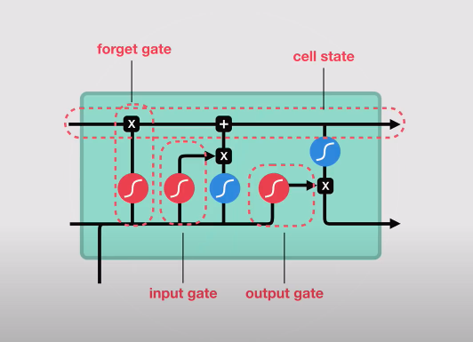

# Stock Prediction with LSTM

## Financial Time Series Price Prediction

### Project Settings:
* **Objective**: Predict SMA30 at T+29 for each time point T.
* **Target Data**: S&P 500 (SPY) daily historical price.
* **Time Period**: 1993-01-29 to 2020-05-06.
* **Train Test Split**: 
	* **Training Set**: First 70% data
	* **Validation Set**: Another 15% data
	* **Test Set**: The rest 15% data 
* **Deep Learning Model**: LSTM

## LSTM
* **LSTM Cell**

* **LSTM Structure**

## Training
- **Input Sequence(x)**：Closing Price at t-9, t-8, ... t.
- **Output(y)**：SMA30 at t+29
- **Batch Size**：4780 (Traing Set Size)
- **Training Epoch**：3000
- **Hidden Layer Dimension**：32
- **Number of Layers**：2
- **Optimizer**：Adam
- **Learning Rate**：0.01
- **Loss Function**：MSE Loss (Mean of a batch)

## Result
- **SMA30 Ground Truth vs Prediction**

- **Zoom in the Prediction Period**

- **Training & Validation Loss** (forgot to adjust the font size tho...)

## References: 
* [Youtube](https://www.youtube.com/watch?v=8HyCNIVRbSU&)
* [StackAbuse](https://stackabuse.com/time-series-prediction-using-lstm-with-pytorch-in-python/)
* [Kaggle](https://www.kaggle.com/taronzakaryan/stock-prediction-lstm-using-pytorch)